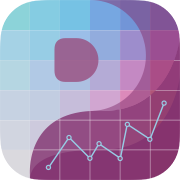

    

# Perspective

Perspective is a friendly charting iOS App for your everyday use. Nowadays, Data is everywhere, and we tend to feel like we have a picture, when in fact - it's more like a blurry, vague idea. 
Data wants to speak in charts, eager to offer a perspective, a perspective that has the potential to extend foresight.

## Overview
Time Series: Progress measured in time is one of my favorite perspectives. We can visualize our progress, see our limits and reach beyond them. 

    

Contingency: Inspired by Eisenhower's matrix of what is important and what is urgent, we can plot all kinds of contingency charts - to better weigh what truly matters and where our focus should be.

    

iOS12: As a challenge to myself and, quite frankly, reminiscent of my old iPhone 5s, I started the app with iOS12 in mind. It turned out to be a great learning curve since it forced me to see its limitations and uncover workarounds.

  

## Roadmap

 • Overlayed Chart Data Display
 • Redesigned Habit Chart
•  Tapped Collection Data Highlights
•  Redesigned Modal for Creating a new Perspective
•  Share Charts
•  Custom User Colors
•  Custom Chart Moving Average
•  Bar Charts
•  Pie & Radar Charts

## About
> "For me, Perspective is a passion project, a tool I use every day.  
I love charts, and basically, I chart everything in my head. 
So I thought to myself. Why not make an app? Share with my loved ones - something tangible, something visual, offer them a perspective."
